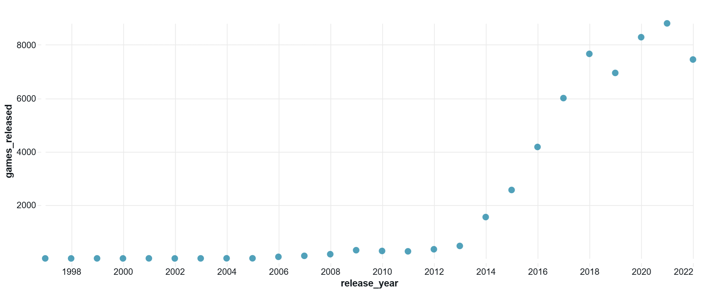
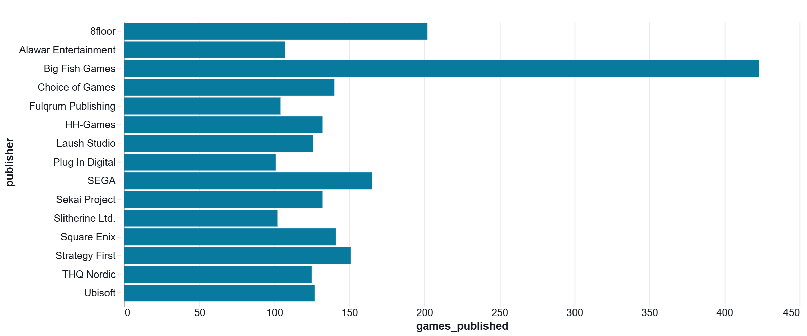
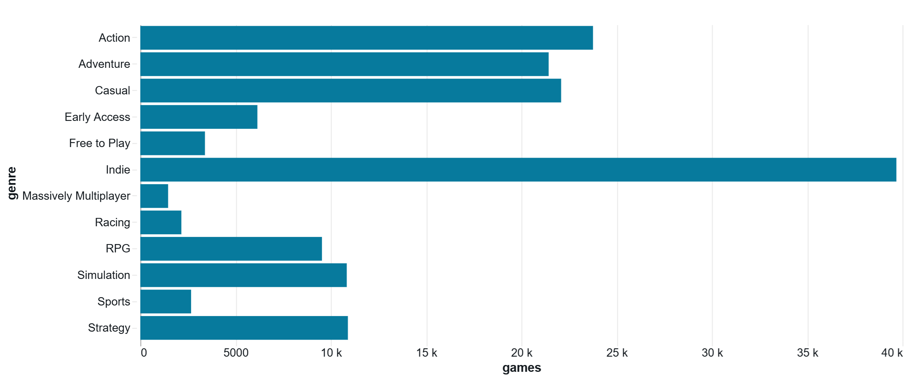
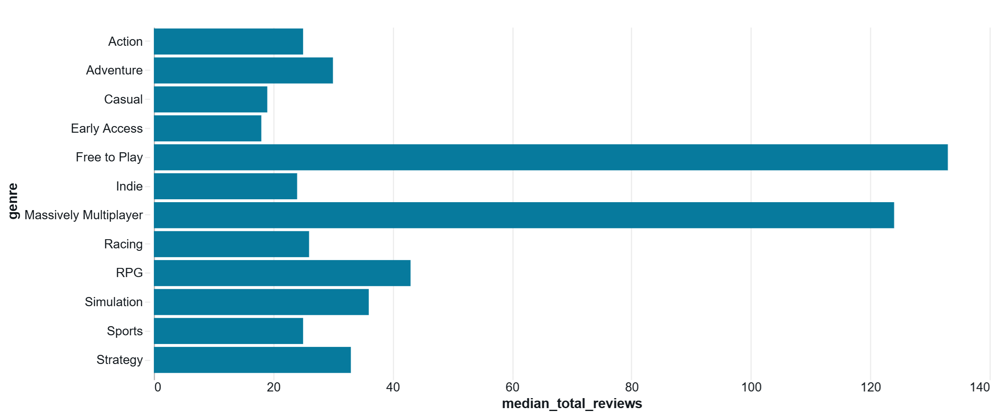
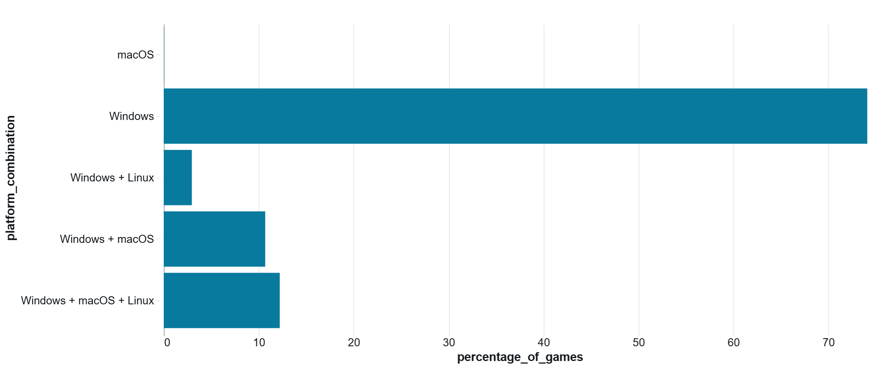

# Steam's Videogames Platform — Big Data Analysis

## Overview

This project analyzes the Steam videogame catalogue using **PySpark and Databricks** to help Ubisoft better understand the competitive environment of the Steam platform.

The analysis focuses on three complementary dimensions:

- the overall Steam market and publisher landscape;
- genre representation, pricing, popularity, and player reception;
- platform availability and relationships between game characteristics and performance indicators.

The objective is to answer:

> **What does the Steam videogame market look like, and what factors appear associated with successful or popular games?**

The project uses review volume, estimated ownership, and concurrent users as **proxies for popularity and reach**. These indicators are not interpreted as direct measures of sales, revenue, or profitability.

---

## Dataset

The dataset is provided as a nested JSON file hosted on Amazon S3:

`steam_game_output.json`

It contains information about more than **55,000 Steam applications**, including:

- game and publisher information;
- release dates;
- prices and discounts;
- positive and negative reviews;
- estimated ownership ranges;
- concurrent users;
- genres and languages;
- Windows, macOS, and Linux availability.

After data preparation and removal of one non-game application, the analytical dataset contains **55,690 unique videogames and 37 prepared features**.

---

## Technologies

- Python
- PySpark
- Apache Spark
- Databricks
- Delta Lake
- Amazon S3
- Git / GitHub

The analytical workflow remains **Spark-first**: cleaning, transformations, categorical expansion, aggregations, and numerical analysis are performed using PySpark rather than converting the complete dataset to pandas.

---

## Project Structure

```text
2_Steam_videogames_platform/
├── notebooks/
│   ├── 01_Steam_Data_Preparation.ipynb
│   ├── 02_Steam_Market_Analysis.ipynb
│   └── 03_Steam_Genre_Platform_Analysis.ipynb
├── outputs/
│   └── figures/
├── README.md
├── requirements.txt
└── .gitignore
```

### 01 — Steam Data Preparation

Loads the nested JSON dataset from S3, inspects its schema, evaluates data quality, cleans the selected fields, and creates reusable analytical features.

Key transformations include:

- nested-field extraction;
- missing and empty-value handling;
- release-date parsing;
- price and discount preparation;
- review and popularity metrics;
- ownership-range parsing;
- genre and language arrays;
- platform-support features.

The prepared dataset is persisted as a Delta table for the subsequent notebooks.

### 02 — Steam Market Analysis

Explores the Steam ecosystem at market level:

- evolution of videogame releases;
- publisher landscape;
- free versus paid games;
- pricing and discount patterns;
- language availability;
- age restrictions;
- player reception and popularity;
- ownership and concurrent-user proxies.

### 03 — Genre & Platform Analysis

Uses Spark transformations such as `explode`, `groupBy`, `countDistinct`, aggregations, and correlations to analyze:

- genre representation;
- player reception by genre;
- popularity by genre;
- genre pricing;
- operating-system availability;
- cross-platform support;
- genre × platform patterns;
- focused multivariate relationships.

Because games can belong to several genres, genre-level results represent **overlapping associations rather than mutually exclusive market shares**.

---

## Key Findings

### Steam is a large and increasingly crowded catalogue

Steam videogame releases expanded strongly from the mid-2010s, reaching **8,805 releases in 2021**. The 2022 observations are incomplete because the latest release date in the dataset is November 11, 2022.

The publisher ecosystem is highly fragmented, with almost **30,000 distinct publisher entries**. Ubisoft appears among the largest publishers by catalogue count, with **127 games** in the dataset.

### Paid games dominate the catalogue

Approximately **86% of games are paid** and 14% are free.

Among paid games, the median initial price is **5.99**, while the mean is higher, reflecting a right-skewed price distribution.

### Player attention is highly concentrated

The typical Steam game receives relatively few reviews, while a small group of major titles attracts extremely high review volumes.

Counter-Strike: Global Offensive exceeds **6.7 million reviews**, while Ubisoft's **Tom Clancy's Rainbow Six Siege exceeds 1.08 million reviews** and is among the most-reviewed games in the dataset.

This concentration also appears in estimated ownership and concurrent-user activity.

### Popularity and satisfaction are different dimensions

For genre-level reception, games were required to have at least **750 reviews**, and genres required at least **100 qualifying games**.

Among these established genres, Casual, Indie, and Adventure show comparatively strong median positive-review ratios.

By contrast, Free to Play and Massively Multiplayer games generate higher typical review activity, while their median player reception is lower.

The multivariate analysis reinforces this distinction: review volume is strongly associated with concurrent users and estimated ownership, while positive-review ratio has almost no linear correlation with these popularity indicators.

### Genre prevalence does not imply stronger performance

Indie, Action, Casual, and Adventure are the most frequently associated genre labels in the Steam catalogue.

However, the most represented genres are not automatically those with the highest player reception or typical review activity. Genre should therefore be treated as one component of product positioning rather than a deterministic success factor.

### Steam is overwhelmingly Windows-oriented

Windows is supported by **99.97%** of games in the dataset, compared with **22.93% for macOS** and **15.19% for Linux**.

Approximately **74% of games support only one operating system**, overwhelmingly Windows, while **12.22% support Windows, macOS, and Linux**.

Games supporting more operating systems show higher median review activity and somewhat stronger reception descriptively, but this represents an **association rather than evidence of causation**.

---

## Selected Visualizations

### Steam Videogame Releases by Year



Steam releases increased substantially from the mid-2010s, illustrating the growing competitive density of the platform. The 2022 observations represent an incomplete year.

### Top Publishers



The publisher ecosystem is highly fragmented. Ubisoft nevertheless appears among the largest publishers in the dataset by catalogue count.

### Most Represented Genres



Indie, Action, Casual, and Adventure dominate genre associations. Because games can have multiple genre labels, these categories overlap and should not be interpreted as market shares.

### Popularity by Genre



Free to Play and Massively Multiplayer games show the highest typical review activity among the established genre groups, demonstrating that catalogue prevalence and player attention are different dimensions.

### Platform Availability



Windows dominates Steam availability, while support for macOS and Linux represents additional cross-platform reach.

---

## Business Takeaways for Ubisoft

The analysis suggests several considerations for future Steam positioning:

- compete through product differentiation rather than catalogue volume alone;
- evaluate **player reach and player satisfaction separately**;
- use genre performance as a competitive benchmark rather than assuming a universally superior genre;
- benchmark pricing against comparable genre and product positioning;
- consider localization as an accessibility and international-reach strategy;
- treat Windows as the baseline Steam platform and evaluate macOS/Linux support based on incremental audience potential and development cost;
- use successful Ubisoft Steam titles such as Rainbow Six Siege as internal reference points while avoiding direct generalization to future products.

---

## Limitations

This analysis is descriptive and should not be interpreted as a forecasting or causal model.

Important limitations include:

- the dataset represents a snapshot of the Steam catalogue;
- 2022 is incomplete;
- review volume is a popularity proxy rather than a sales measure;
- positive-review ratio measures reception rather than profitability;
- ownership is provided in broad ranges and converted to approximate midpoints;
- concurrent users represent snapshot activity;
- games may belong to multiple genre categories;
- publisher names are not consolidated into corporate groups;
- platform and language availability do not measure implementation quality or development cost;
- highly skewed variables can influence Pearson correlations;
- observed relationships do not establish causality.

The findings should therefore be interpreted as **market benchmarks and descriptive associations**.

---

## Conclusion

The Steam ecosystem combines a large and fragmented catalogue with highly concentrated player attention.

The analysis shows that catalogue presence, popularity, and player satisfaction are distinct dimensions. Genre, pricing, localization, and platform availability provide useful positioning context, but none independently explains videogame performance.

For Ubisoft, the strongest strategic use of this analysis is therefore as a **competitive benchmarking framework**: evaluate future Steam releases simultaneously in terms of market positioning, potential reach, and player reception.

